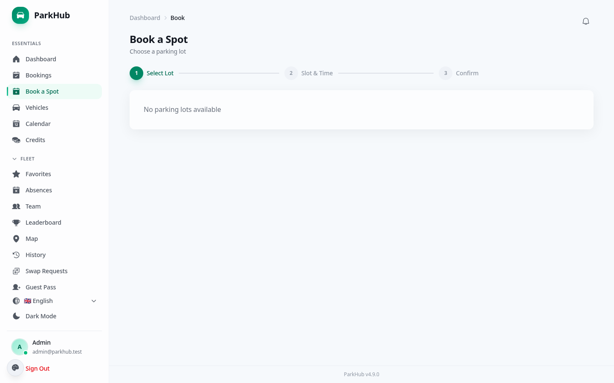
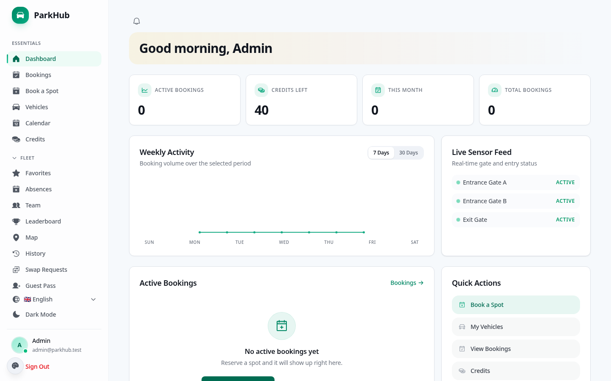
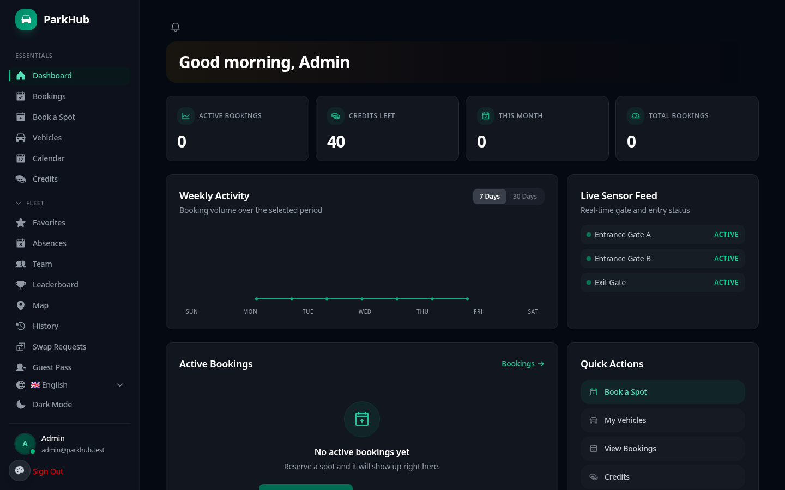

<p align="center">
  
</p>

<h1 align="center">ParkHub PHP -- Self-Hosted Parking Management</h1>

<p align="center">
  <a href="https://github.com/nash87/parkhub-php/actions/workflows/ci.yml"></a>
  <a href="CHANGELOG.md"></a>
  <a href="LICENSE"></a>
  <a href="https://www.php.net/"></a>
  <a href="https://laravel.com/"></a>
  <a href="https://react.dev/"></a>
  <a href="https://tailwindcss.com/"></a>
  
  <a href="docs/GDPR.md"></a>
  <a href="docs/COMPLIANCE.md"></a>
  <a href="docker-compose.yml"></a>
  <a href="helm/README.md"></a>
</p>

<p align="center">
  <strong>Ihre Daten. Ihr Server. Ihre Kontrolle.</strong><br>
  The on-premise parking management runtime for the canonical ParkHub product -- optimized for shared hosting, VPS, Docker, and Kubernetes.<br>
  Built with Laravel 12, React 19, and Tailwind CSS 4. Zero cloud. Zero tracking. 100% GDPR compliant by design.
</p>

<p align="center">
  <a href="https://parkhub-php-demo.onrender.com"><strong>Try the Live Demo</strong></a> &nbsp;|&nbsp;
  <a href="docs/INSTALLATION.md">Installation</a> &nbsp;|&nbsp;
  <a href="helm/README.md">Helm Chart</a> &nbsp;|&nbsp;
  <a href="docs/API.md">API Docs</a> &nbsp;|&nbsp;
  <a href="docs/GDPR.md">GDPR Guide</a> &nbsp;|&nbsp;
  <a href="docs/COMPLIANCE.md">Compliance</a> &nbsp;|&nbsp;
  <a href="docs/SECURITY.md">Security</a> &nbsp;|&nbsp;
  <a href="CHANGELOG.md">Changelog</a>
</p>

---

## Product Model

ParkHub is one product with multiple runtimes. This PHP edition shares the same core product model as the Rust edition, while keeping a PHP-first deployment story: Laravel, shared hosting compatibility, and conventional web stack flexibility.

Not every advanced module is equally hardened or equally enabled by default across runtimes. Treat the shared booking, admin, compliance, and theme surfaces as the core product line; treat advanced integrations, pass/check-in surfaces, and enterprise modules as optional and runtime-sensitive.

---

## Why Self-Hosted?

Most parking management SaaS costs 200--2,000 EUR/month, stores your data on US cloud infrastructure, and requires a data processing agreement just to get started.

ParkHub is different. It runs on your server -- a shared hosting plan, a VPS, or your company network. Your data never leaves your premises, which means **no GDPR processor agreement needed**, no CLOUD Act exposure, and no monthly fees. The entire source code is MIT-licensed and auditable.

---

## Quick Start

### Docker (recommended)

```bash
git clone https://github.com/nash87/parkhub-php.git && cd parkhub-php
docker compose up -d
# Open http://localhost:8080 -- Login: admin@parkhub.test / demo
```

The first build takes 2--5 minutes (installs Composer + Node dependencies, builds the React frontend). After that, starts are instant. Custom credentials from the start:

```bash
PARKHUB_ADMIN_EMAIL=you@company.com PARKHUB_ADMIN_PASSWORD=secure docker compose up -d
```

### Shared Hosting

ParkHub PHP runs on any 3 EUR/month shared hosting with PHP 8.2+ and MySQL. Upload via FTP, open `install.php` in your browser, done. See [Installation Guide](docs/INSTALLATION.md).

### Laravel Sail

```bash
git clone https://github.com/nash87/parkhub-php.git && cd parkhub-php
cp .env.example .env
composer install
./vendor/bin/sail up -d
./vendor/bin/sail artisan migrate --seed
# Open http://localhost -- Email: admin@parkhub.test  Password: demo
```

### Development

```bash
composer setup                        # Install + configure + migrate + build
composer dev                          # Dev server + Vite + queue + logs
php artisan test                      # Run 1,565 PHPUnit tests
```

**[Live Demo](https://parkhub-php-demo.onrender.com)** | Login: `admin@parkhub.test` / `demo` | (auto-resets every 6 hours)

---

## Features

### v4.1.0 Highlights

- **Booking Sharing & Guest Invites** -- Share bookings via secure links with optional expiry, invite guests by email
- **Scheduled Reports (Email Digest)** -- Automated daily/weekly/monthly report delivery via email (occupancy, revenue, activity, trends)
- **API Versioning & Deprecation** -- `X-API-Version` header, deprecation notices, version changelog endpoint

### v4.0.0 Highlights

- **Plugin/Extension System** -- Event-hook based plugin architecture with admin marketplace UI, 2 built-in plugins (Slack Notifier, Auto-Assign Preferred Spot)
- **GraphQL API** -- Query parser mapped to REST handlers with interactive GraphiQL playground
- **Compliance Reports** -- GDPR/DSGVO compliance dashboard with 10 automated checks, Art. 30 data map, audit trail export

### v3.6--v3.9 Highlights

- **Parking History & Stats** -- Personal booking timeline with monthly trends and favourite lot stats
- **Geofencing & Auto Check-in** -- GPS proximity-based auto check-in
- **Enhanced Waitlist** -- Priority-based with accept/decline offers and 15-minute expiry
- **Digital Parking Pass** -- QR badge with public verification endpoint
- **Absence Approval Workflows** -- Submit/approve/reject with admin queue and comments
- **Calendar Drag-to-Reschedule** -- Drag events to new dates with conflict detection
- **Customizable Admin Widgets** -- 8 configurable dashboard widgets with per-user layout
- **Kubernetes Helm Chart** -- Production chart with HPA, PVC, Laravel-specific config
- **k6 Load Testing Suite** -- Smoke, load, stress, and spike test scripts
- **Postman Collection** -- 100+ requests with auto-token handling

### Core Highlights

- **Full booking lifecycle** -- One-tap quick booking, recurring reservations, guest bookings, swap requests, waitlists, automatic no-show release
- **Automatic pricing** -- Hourly rate x duration, 19% German VAT, daily max cap, monthly passes, dynamic pricing
- **Visual lot editor** -- Per-lot zones, slot types (standard, compact, handicap, EV, VIP, motorcycle), real-time occupancy, public lobby display
- **Interactive map** -- Leaflet-based map view with color-coded availability markers
- **4-tier RBAC** -- User, premium, admin, superadmin with Sanctum token auth and 2FA/TOTP
- **Vehicle management** -- Photo upload, German licence plate city-code lookup (400+ codes)
- **Absence tracking** -- Homeoffice, vacation, sick leave with iCal import/export and team overview
- **10 languages** -- EN, DE, FR, ES, IT, PT, TR, PL, JA, ZH with runtime hot-loading
- **12 switchable themes** -- theme switching is part of the product contract, but the exact runtime theme set is still being pulled onto a shared semantic registry and parity gate
- **PWA** -- Installable as native app, service worker for offline capability, Command Palette (Ctrl+K)
- **Observability** -- Prometheus metrics at `/api/metrics`, health endpoints, structured logging

### Auth Contract

- **Core auth** -- login, registration, password reset, RBAC, 2FA/TOTP, session management
- **Integration auth** -- OAuth providers such as Google and GitHub
- **Enterprise identity** -- SAML/SSO and similar flows remain optional and runtime-sensitive

### Theme Contract

- **Shared product surface** -- themes are a core ParkHub surface, not decorative runtime extras
- **Semantic parity first** -- theme switching must preserve state clarity, hierarchy, contrast, and critical controls across runtimes
- **Registry alignment in progress** -- the current PHP frontend exposes a different concrete theme inventory than the public README previously claimed, so public naming is gated until both runtimes match the shared registry

### Security

- **httpOnly cookie auth** with SameSite=Lax (XSS-proof, Bearer fallback for APIs)
- bcrypt password hashing (12 rounds), configurable password policies
- 2FA/TOTP with QR enrollment, backup codes
- Per-endpoint rate limiting (login, register, payments)
- Nonce-based CSP, security headers middleware
- Full audit log with IP tracking
- API key authentication for integrations
- OWASP Top 10 compliance -- see [Security Model](docs/SECURITY.md)

### Admin & Analytics

- Live occupancy dashboard with booking heatmaps
- Revenue analytics with 30-day trends, peak hours, top lots
- Rate limit monitoring dashboard
- CSV export, PDF invoices, admin reports
- Custom branding, announcements, outbound webhooks
- Multi-tenant support for enterprise deployments

### Notification Contract

- **Core notifications** -- in-app notifications plus transactional email
- **Advanced notifications** -- Web Push via VAPID where configured
- **Gated channels** -- SMS/WhatsApp preference surfaces exist, but delivery remains gated unless explicitly proven operational in the active runtime

### Guest and Pass Contract

- **Core guest flow** -- guest bookings and host-visible guest handling
- **Advanced pass flow** -- digital passes, QR generation, visitor pre-registration, and check-in surfaces
- **Runtime-sensitive surfaces** -- QR/check-in/public verification flows should be treated as advanced and runtime-sensitive, not as unconditional baseline behavior

### Legal Compliance

- **GDPR / DSGVO** -- Art. 15 data export, Art. 17 erasure, Art. 20 portability
- **German law** -- DDG SS5 Impressum, TTDSG SS25 cookie policy, SS147 AO retention
- **7 legal templates** -- Impressum, Datenschutz, AGB, Widerrufsbelehrung, AVV, VVT, Cookie Policy
- **International** -- UK GDPR, CCPA, nDSG (Switzerland), LGPD (Brazil) compatible
- See [GDPR Guide](docs/GDPR.md) | [Compliance Matrix](docs/COMPLIANCE.md)

---

## Module System

ParkHub organizes functionality into **67 runtime-toggleable modules** across five categories. Toggle any module via `MODULE_*=true|false` environment variables.

### Core Modules (20 -- enabled by default, opt-out)

| Module | Description |
|--------|-------------|
| Bookings | Full booking lifecycle with conflict detection |
| Vehicles | Vehicle CRUD with photo upload and plate lookup |
| Absences | Leave tracking with iCal import |
| Zones | Per-lot zone management |
| Slots | Slot CRUD with status tracking |
| Lots | Lot management with layout editor |
| Recurring | Recurring booking patterns |
| Favourites | Favourite slot pinning |
| Swap | Booking swap requests |
| Waitlist | Waitlist for full lots |
| Credits | Credit system for bookings |
| Themes | 12 switchable design themes |
| Notifications | In-app notifications |
| QR Codes | QR code generation for bookings |
| Invoices | PDF invoice generation |
| Operating Hours | Lot operating hour configuration |
| iCal | Calendar subscription feeds |
| Map | Interactive Leaflet map view |
| Lobby Display | Public occupancy display board |
| GDPR | Data export and erasure endpoints |

### Admin Modules (8 -- enabled by default, opt-out)

| Module | Description |
|--------|-------------|
| Admin Reports | Stats, heatmaps, CSV export |
| Analytics | 30-day trends, revenue, peak hours, user growth |
| Data Export | Bulk data export for admins |
| Import | Data import from CSV/JSON |
| Metrics | Prometheus metrics at `/api/metrics` |
| Rate Dashboard | Real-time rate limit monitoring |
| Compliance | GDPR compliance reports with 10 automated checks |
| Scheduled Reports | Automated email digest delivery |

### Feature Modules (18 -- enabled by default, opt-out)

| Module | Description |
|--------|-------------|
| Visitors | Visitor pre-registration with QR passes |
| EV Charging | EV charging station management |
| Accessible | Accessible parking with priority booking |
| Maintenance | Maintenance scheduling with auto-block |
| Cost Center | Cost center billing and analytics |
| Fleet | Fleet/vehicle management overview |
| History | Personal parking history and stats |
| Geofence | Geofencing with GPS auto check-in |
| Waitlist Ext | Enhanced waitlist with priority and notifications |
| Parking Pass | Digital QR badge with public verification |
| Absence Approval | Absence approval workflows |
| Calendar Drag | Drag-to-reschedule on calendar |
| Widgets | Customizable admin dashboard widgets |
| Sharing | Booking sharing and guest invites |
| API Versioning | API version headers and deprecation |
| Plugins | Plugin/extension system with event hooks |
| GraphQL | GraphQL API with interactive playground |
| API Docs | Interactive API documentation |

### Integration Modules (8 -- disabled by default, opt-in)

| Module | Description | Requires |
|--------|-------------|----------|
| Stripe | Checkout sessions, webhooks, payment history | Stripe API keys |
| OAuth | Social login (Google, GitHub, etc.) | OAuth credentials |
| Web Push | VAPID-based browser push notifications | VAPID keys |
| Webhooks | Outbound webhooks with HMAC signing | Webhook URLs |
| Push Notifications | Legacy push notification support | Push service |
| Broadcasting | Real-time event broadcasting | Broadcasting driver |
| Realtime | Server-Sent Events (SSE) | -- |
| Email Templates | Professional HTML email templates | SMTP |

### Enterprise Modules (4 -- disabled by default, opt-in)

| Module | Description |
|--------|-------------|
| Multi-Tenant | Tenant isolation with scoping middleware |
| Dynamic Pricing | Time-based and demand-based pricing rules |
| Setup Wizard | Interactive onboarding wizard |
| Branding | Custom logo, colors, company name |

---

## Architecture

```
                    +---------------------------------+
                    |     React 19 SPA                |
                    |   TypeScript - Tailwind CSS 4   |
                    +---------------+-----------------+
                                    | httpOnly Cookie + Bearer (Sanctum)
                    +---------------v-----------------+
                    |     Laravel 12 + PHP 8.4         |
                    |   /api/v1/*  - /api/metrics      |
                    |   /health/*  - Web Push (VAPID)  |
                    +---------------------------------+
                    |  MySQL 8 - SQLite - PostgreSQL   |
                    +---------------------------------+
                        Docker - Shared Hosting - VPS
```

ParkHub PHP is designed for maximum deployment flexibility. It runs on 3 EUR/month shared hosting (Strato, IONOS, All-Inkl) with just PHP and MySQL, scales up to Docker Compose and Kubernetes, and supports PostgreSQL for cloud-native PaaS platforms like Render and Railway.

The same React 19 frontend is shared with the [Rust edition](https://github.com/nash87/parkhub-rust), and both editions are intended to stay aligned under the same ParkHub product model. Deployment tradeoffs and advanced module hardening can still differ by runtime.

For a deep dive into the directory layout, controllers, middleware, database schema, and frontend internals, see **[ARCHITECTURE.md](ARCHITECTURE.md)**.

---

## Screenshots

| | |
|---|---|
|  |  |
| Dashboard with occupancy stats | Interactive booking flow |
|  |  |
| Admin panel with lot management | Full dark mode support |

---

## Deployment Options

| Method | Complexity | Cost | Best For |
|--------|------------|------|----------|
| **Shared Hosting** | Low | 3 EUR/mo | Small teams, personal use |
| **Docker** | Low | VPS cost | Standard deployment |
| **VPS / LAMP** | Medium | VPS cost | Full control |
| **PaaS** (Render, Railway) | Low | Free tier available | Quick demos, startups |
| **Kubernetes** | High | Cluster cost | Enterprise, multi-tenant |

See [docs/INSTALLATION.md](docs/INSTALLATION.md) for step-by-step guides for each method.

---

## Testing

**1,700+ backend tests** -- plus Vitest frontend and 29 Playwright E2E specs. CI runs on every push via GitHub Actions. Lighthouse CI enforces accessibility >= 95, performance >= 90.

```bash
composer test                       # PHPUnit backend
cd parkhub-web && npx vitest run    # Frontend
npx playwright test                 # E2E
```

### CI & Security Scanning

- **GitHub Actions** CI on every push (PHPUnit, Vitest, Pint lint, Larastan static analysis)
- **CodeQL** -- automated code scanning, 0 open alerts
- **Trivy** -- container image vulnerability scanning
- **Dependabot** -- automated dependency updates with auto-merge for patch/minor

---

## Configuration

Key environment variables (full list in [docs/CONFIGURATION.md](docs/CONFIGURATION.md)):

| Variable | Purpose |
|----------|---------|
| `DB_CONNECTION` | `mysql`, `sqlite`, or `pgsql` |
| `DB_HOST` / `DB_DATABASE` / `DB_USERNAME` / `DB_PASSWORD` | Database connection |
| `DATABASE_URL` | Alternative single-URL format (PaaS platforms) |
| `MAIL_HOST` / `MAIL_USERNAME` / `MAIL_PASSWORD` | SMTP email |
| `PARKHUB_ADMIN_EMAIL` / `PARKHUB_ADMIN_PASSWORD` | Initial admin account |
| `DEMO_MODE=true` | Enable demo overlay with 6-hour auto-reset |
| `MODULE_*=true\|false` | Toggle individual modules (see [Module System](#module-system)) |

---

## API Documentation

Full REST API documentation at `/api/v1/*` is available in [docs/API.md](docs/API.md). The API mirrors the [Rust edition](https://github.com/nash87/parkhub-rust) endpoint structure, making both backends interchangeable.

Interactive API documentation is available via Scramble at `/docs/api` when enabled.

---

## Legal Compliance

ParkHub PHP is designed for legal compliance across multiple jurisdictions. Audited against **9 regulatory frameworks**:

**GDPR** (EU) | **DSGVO** (DE) | **TTDSG** (DE) | **DDG** (DE) | **BDSG** (DE) | **NIS2** (EU) | **CCPA** (US) | **UK GDPR** | **nDSG** (CH)

All legal documents are provided as **operator-customizable templates** -- not binding legal texts.

| Document | Purpose | Location |
|----------|---------|----------|
| **GDPR / DSGVO Guide** | Full DSGVO compliance documentation | [docs/GDPR.md](docs/GDPR.md) |
| **Compliance Matrix** | German, EU, and international law mapping | [docs/COMPLIANCE.md](docs/COMPLIANCE.md) |
| **Security Model** | Architecture, OWASP, encryption, disclosure | [docs/SECURITY.md](docs/SECURITY.md) |
| **Privacy Notice Template** | Ready-to-use Datenschutzerklarung (DE) | [docs/PRIVACY-TEMPLATE.md](docs/PRIVACY-TEMPLATE.md) |
| **Impressum Template** | German Impressum per DDG SS5 | [docs/IMPRESSUM-TEMPLATE.md](docs/IMPRESSUM-TEMPLATE.md) |
| **Third-Party Licenses** | All dependencies with license verification | [LICENSE-THIRD-PARTY.md](LICENSE-THIRD-PARTY.md) |
| **AGB Template** | Terms of service (DE) | [legal/agb-template.md](legal/agb-template.md) |
| **AVV Template** | Data processing agreement (DE) | [legal/avv-template.md](legal/avv-template.md) |
| **VVT Template** | Records of processing activities | [legal/vvt-template.md](legal/vvt-template.md) |
| **Cookie Policy** | TTDSG SS25 localStorage documentation | [legal/cookie-policy-template.md](legal/cookie-policy-template.md) |
| **Widerrufsbelehrung** | Consumer withdrawal notice (DE) | [legal/widerrufsbelehrung-template.md](legal/widerrufsbelehrung-template.md) |

---

## Rust Edition

A feature-equivalent **Rust edition** (Axum + redb embedded DB) exists for environments that need a single binary with zero dependencies, AES-256-GCM database encryption, or a desktop client with system tray integration.

**[nash87/parkhub-rust](https://github.com/nash87/parkhub-rust)**

---

## Contributing

Contributions welcome -- see [CONTRIBUTING.md](CONTRIBUTING.md) for development setup,
branch naming conventions, testing requirements, code style (Pint + Larastan), and PR process.

Bug reports and feature requests: [GitHub Issues](https://github.com/nash87/parkhub-php/issues)

Security vulnerabilities: [Security Policy](SECURITY.md) (do not open public issues)

---

## License

MIT -- see [LICENSE](LICENSE).

All third-party dependencies are MIT, Apache-2.0, or BSD licensed. See [LICENSE-THIRD-PARTY.md](LICENSE-THIRD-PARTY.md) for the full list.
